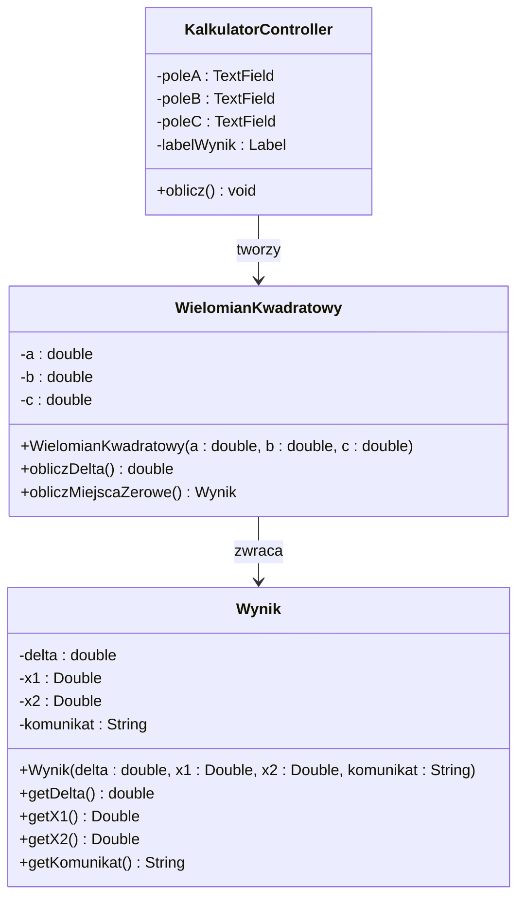
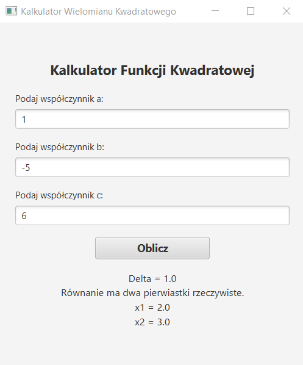
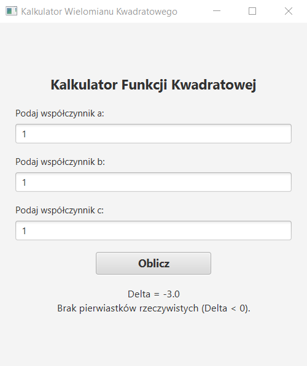
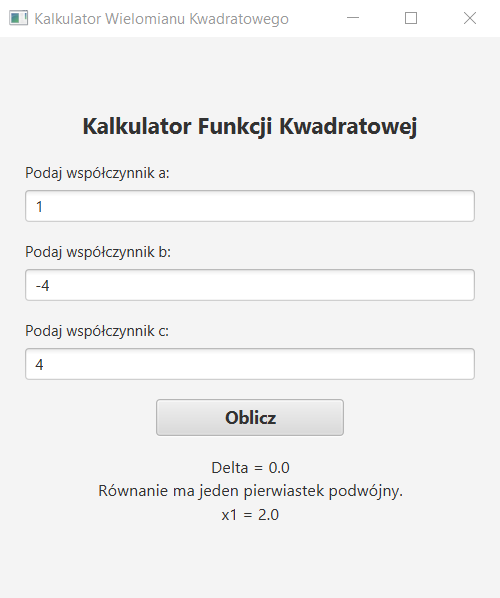

# Zadanie laboratoryjne  


[](https://en.cppreference.com/w/)
[](https://docs.oracle.com/en/java/)

**Przedmiot:** *Programowanie obiektowe*  

##  Dane studenta


##  Informacje o zadaniu

| Pole | Wartość |
|---|---|
| Numer laboratorium | 3 |
| Temat laboratorium | Aplikacja JavaFX z FXML – kalkulator miejsc zerowych wielomianu kwadratowego |
| Data realizacji | 06.06.2026 |
| Data oddania | 06.06.2026 |
| Język programowania | Java |
| Środowisko / IDE | IntelliJ IDEA |

##  Treść zadania

Krótki opis zadania:

Napisz program, wykorzystujący FXML jako GUI i zaimplementuj, wykorzystując OOP, aplikację pobierającą od użytkownika wartości a, b, c wielomianu kwadratowego i obliczającą miejsca zerowe funkcji.

##  Wymagania funkcjonalne

| ID | Opis wymagania | Poziom |
|---|---|---|
| WF-01 | Aplikacja posiada interfejs graficzny zbudowany w technologii JavaFX z użyciem pliku FXML. | Wysoki |
| WF-02 | Użytkownik może wprowadzić wartości współczynników a, b, c wielomianu kwadratowego w polach tekstowych. | Wysoki |
| WF-03 | Program oblicza wyróżnik (deltę) i wyznacza miejsca zerowe funkcji po kliknięciu przycisku. | Wysoki |
| WF-04 | Program obsługuje trzy przypadki: dwa pierwiastki rzeczywiste, jeden pierwiastek podwójny oraz brak pierwiastków rzeczywistych. | Wysoki |
| WF-05 | Wyniki obliczeń są wyświetlane w interfejsie graficznym z odpowiednim komunikatem. | Wysoki |
| WF-06 | Logika obliczeniowa jest wydzielona do osobnej klasy modelu zgodnie z zasadami OOP. | Wysoki |

##  Wymagania niefunkcjonalne

| ID | Opis wymagania | Poziom |
|---|---|---|
| WN-01 | Kod jest napisany w języku Java zgodnie z zasadami programowania obiektowego. | Wysoki |
| WN-02 | Program kompiluje się bez błędów w środowisku IntelliJ IDEA z użyciem Maven lub modułu JavaFX. | Wysoki |
| WN-03 | Interfejs graficzny jest zbudowany z użyciem pliku FXML (SceneBuilder). | Wysoki |
| WN-04 | Kod jest czytelny i podzielony na klasy: model (logika obliczeń) i kontroler (obsługa GUI). | Średni |

##  Realizacja zadania


Opis implementacji:
Aplikacja została zrealizowana w języku Java (wersja 17) z wykorzystaniem biblioteki graficznej JavaFX oraz systemu budowania Maven. Projekt został zaprojektowany zgodnie ze strukturą warstwową i wzorcem MVC (Model-View-Controller), co zapewnia wyraźne oddzielenie logiki biznesowej od interfejsu użytkownika:

1. **Warstwa Modelu (Logika):** Klasa `WielomianKwadratowy` odpowiada za przechowywanie współczynników równania oraz realizację obliczeń matematycznych (wyznaczanie wyróżnika delta oraz miejsc zerowych). Klasa `Wynik` stanowi obiekt typu DTO (Data Transfer Object), enkapsulujący dane wyjściowe obliczeń wraz z odpowiednim komunikatem tekstowym.
2. **Warstwa Widoku (Interfejs):** Wygląd aplikacji i rozmieszczenie elementów (pola tekstowe, przycisk, etykiety) zdefiniowano w pliku strukturalnym `kalkulator.fxml`.
3. **Warstwa Kontrolera:** Klasa `KalkulatorController` pośredniczy w komunikacji. Pobiera dane wejściowe z pól tekstowych, dokonuje ich bezpiecznej konwersji, inicjalizuje obiekt modelu i przekazuje otrzymane wyniki do warstwy prezentacji.

Aplikacja posiada pełne zabezpieczenie przed wprowadzeniem niepoprawnych danych (np. pustych pól lub znaków niebędących liczbami) za pomocą bloku `try-catch` obsługującego wyjątek `NumberFormatException`. Dodatkowo zaimplementowano warunek sprawdzający, czy współczynnik $a \neq 0$, co gwarantuje poprawność matematyczną realizowanego algorytmu.


##  Diagram klas (jeśli dotyczy)


##  Kod źródłowy


###  Java

```java
package org.example;

public class WielomianKwadratowy {
    private double a;
    private double b;
    private double c;

    public WielomianKwadratowy(double a, double b, double c) {
        this.a = a;
        this.b = b;
        this.c = c;
    }

    public double obliczDelta() {
        return (b * b) - (4 * a * c);
    }

    public Wynik obliczMiejscaZerowe() {
        double delta = obliczDelta();

        if (a == 0) {
            return new Wynik(delta, null, null, "To nie jest funkcja kwadratowa (a=0)!");
        }

        if (delta > 0) {
            double x1 = (-b - Math.sqrt(delta)) / (2 * a);
            double x2 = (-b + Math.sqrt(delta)) / (2 * a);
            return new Wynik(delta, x1, x2, "Równanie ma dwa pierwiastki rzeczywiste.");
        } else if (delta == 0) {
            double x0 = -b / (2 * a);
            return new Wynik(delta, x0, null, "Równanie ma jeden pierwiastek podwójny.");
        } else {
            return new Wynik(delta, null, null, "Brak pierwiastków rzeczywistych (Delta < 0).");
        }
    }
}
	
```

##  Wynik działania programu

Opis testów i przykładowe wyniki:






```bash
[INFO] Scanning for projects...
[INFO] Building aplikacja 1.0-SNAPSHOT
[INFO] --- javafx-maven-plugin:0.0.8:run (default-cli) @ aplikacja ---
[INFO] Aplikacja uruchomiona pomyślnie. Zakończono procesem 0.

```
##  Lista kontrolna samooceny

| Kryterium | Status | Komentarz |
|---|---|---|
| Program kompiluje się bez błędów | Tak | Kod przechodzi kompilację w systemie Maven oraz JDK 17 bez żadnych błędów. |
| Wszystkie wymagania zostały spełnione | Tak | Zaimplementowano pełne wyliczanie wyróżnika delta oraz miejsc zerowych dla każdego przypadku. |
| Kod jest czytelny i podzielony na klasy | Tak | Zastosowano pełen podział na logiczne warstwy zgodnie z diagramem klas (`KalkulatorController`, `WielomianKwadratowy`, `Wynik`). |
| Zastosowano zasady OOP | Tak | Pełne wykorzystanie hermetyzacji (pola prywatne z getterami) oraz obiektowego przekazywania danych DTO. |
| Zastosowano zasady czystego kodu | Tak | Zmienne, pola kontrolera oraz metody posiadają jednoznaczne i samoopisujące się nazwy. | 


